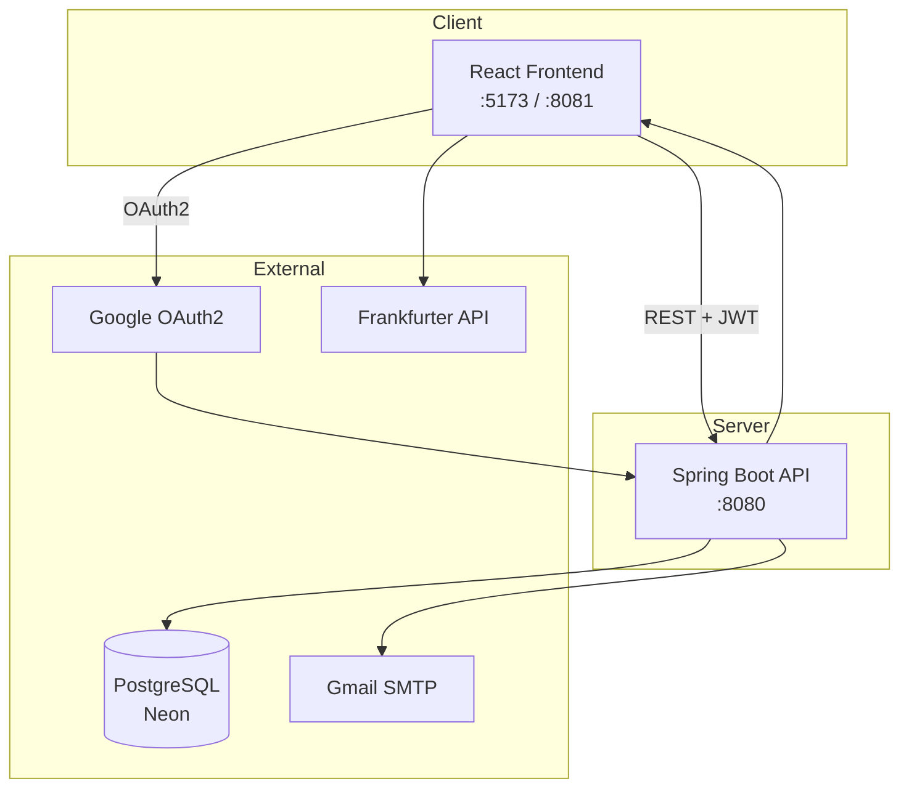
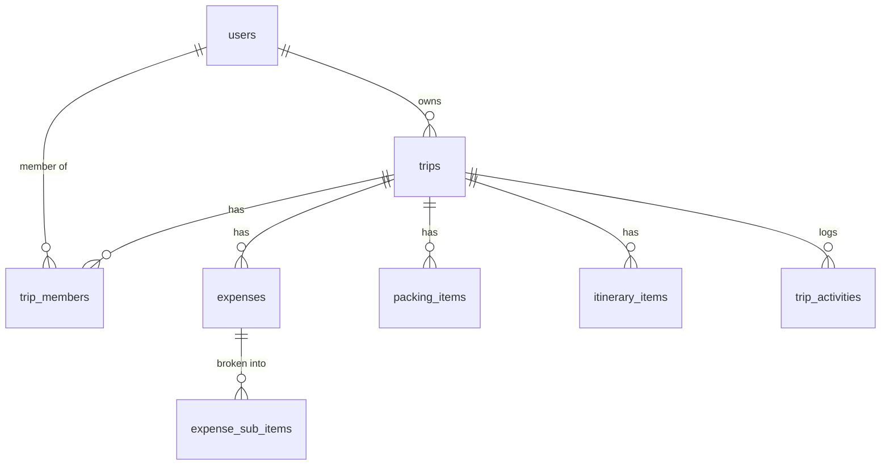

# TravelLuhh

A full-stack travel planning and budget management app. Plan trips, track expenses, split bills, manage packing lists, build itineraries, and review your travel portfolio — all in one place.

> Full technical documentation → [DOCS.md](DOCS.md)

---

## Tech Stack

| Layer | Tech |
|---|---|
| Backend | Spring Boot 3.2.1 · Java 17 · Maven |
| Security | Spring Security + JWT (JJWT) + Google OAuth2 |
| ORM | Spring Data JPA + Hibernate |
| Database | PostgreSQL (Neon cloud) |
| Email | Gmail SMTP |
| Containerisation | Docker + Docker Compose |
| Frontend | React 18 + TypeScript + Vite |
| UI | Tailwind CSS + shadcn/ui |
| Charts | Recharts |
| Animations | Framer Motion |
| Currency | Frankfurter API |

---

## System Architecture



---

## Features

| # | Feature | Status |
|---|---|---|
| 1 | Email signup (OTP) + login | ✅ |
| 2 | Google OAuth2 login | ✅ |
| 3 | Password reset via OTP | ✅ |
| 4 | Trip CRUD (create, view, edit, delete, archive) | ✅ |
| 5 | Expense tracking with category + bundle sub-items | ✅ |
| 6 | Multi-currency support (Frankfurter live rates) | ✅ |
| 7 | Budget types: solo / shared / separated | ✅ |
| 8 | Analytics & Charts (bento layout + category breakdown) | ✅ |
| 9 | Budget alerts (75% / 90% / 100% thresholds) | ✅ |
| 10 | Packing checklist with preset packs | ✅ |
| 11 | Day-by-day itinerary planner | ✅ |
| 12 | Activity feed (expense add/delete, trip updates) | ✅ |
| 13 | Split bill / Settle Up (equal-share model) | ✅ |
| 14 | Destination notes (localStorage) | ✅ |
| 15 | Trip data export (CSV + Print/PDF) | ✅ |
| 16 | Travel portfolio (Year in Review, Timeline, Map) | ✅ |
| 17 | User profile (name, country, currency, password) | ✅ |
| — | Trip member invite / remove / role change | 🚧 UI only, no backend |
| — | Separated budget allocation per member | 🚧 DB table exists, not wired |
| — | Edit expense | 🚧 Not supported yet |
| — | Notes persistence to DB | 🚧 localStorage only |

---

## Quick Start

### Prerequisites

- Docker & Docker Compose
- Node.js 18+

### Run with Docker

```bash
# Clone repo
git clone https://github.com/snsyaqirah/travelluhh.git
cd travelluhh

# Start backend
docker compose up --build -d

# Start frontend
cd frontend
npm install
npm run dev
```

| Service | URL |
|---|---|
| Frontend | http://localhost:5173 |
| Backend API | http://localhost:8080 |

### Environment

**`backend/src/main/resources/application.yml`** (key fields):
```yaml
spring.datasource.url: jdbc:postgresql://<neon-host>/travelluhh
spring.datasource.username: ...
spring.datasource.password: ...
jwt.secret: ...
spring.security.oauth2.client.registration.google.client-id: ...
spring.security.oauth2.client.registration.google.client-secret: ...
spring.mail.username: ...
spring.mail.password: ...    # Gmail app password
```

**`frontend/.env`**:
```env
VITE_API_BASE_URL=http://localhost:8080
```

---

## Project Structure

```
TravelLuhh/
├── backend/src/main/java/com/travelluhh/
│   ├── controller/     REST endpoints
│   ├── service/        Business logic
│   ├── repository/     JPA repositories
│   ├── entity/         JPA entities
│   ├── dto/            Request + Response DTOs
│   ├── security/       JWT filter, OAuth2 handlers
│   └── exception/      Global exception handler
│
├── frontend/src/
│   ├── pages/          Route-level components
│   ├── components/     Feature UI components
│   ├── services/       API call layer
│   ├── hooks/          useTrips, useExpenses
│   ├── context/        AuthContext
│   └── types/          TypeScript interfaces
│
└── docker-compose.yml
```

---

## Database (key tables)



Full schema + column definitions → [DOCS.md § Database Schema](DOCS.md#database-schema)

---

## API Overview

| Domain | Base Path |
|---|---|
| Auth | `POST /api/auth/{initiate-signup,verify-email,complete-signup,login,forgot-password,reset-password,refresh}` |
| Trips | `GET/POST/PUT/DELETE /api/trips/{tripId}` |
| Expenses | `GET/POST/DELETE /api/expenses` |
| Itinerary | `GET/POST/PUT/DELETE /api/trips/{tripId}/itinerary/{itemId}` |
| Packing | `GET/POST/PATCH/DELETE /api/trips/{tripId}/packing/{itemId}` |
| Activity | `GET /api/trips/{tripId}/activity` |
| Settlement | `GET /api/trips/{tripId}/settlement` |
| Users | `GET/PUT /api/users/me` |

Full endpoint table with request/response shapes → [DOCS.md § API Endpoints Reference](DOCS.md#api-endpoints-reference)

---

## Author

**Siti Nursyaqirah** · [@snsyaqirah](https://github.com/snsyaqirah)

---

*Full technical docs, flow diagrams, and known issues → [DOCS.md](DOCS.md)*
