# 🚀 TravelLuhh

> A full-stack travel planning and budget management app — plan trips, track expenses, manage packing lists, and review your travel portfolio.


---

## 📖 Table of Contents

- [Overview](#-overview)
- [Features](#-features)
- [Tech Stack](#-tech-stack)
- [Architecture](#-architecture)
- [User Flow](#-user-flow)
- [Auth Flow](#-auth--session-flow)
- [Database](#-database-erd)
- [API Structure](#-api-structure)
- [Frontend Components](#-frontend-components)
- [Feature Flows](#-feature-specific-flows)
- [Getting Started](#-getting-started)
- [Environment Variables](#-environment-variables)
- [Deployment](#-deployment)
- [Project Structure](#-project-structure)
- [Roadmap](#-roadmap)
- [License](#-license)

---

## 🧭 Overview

TravelLuhh is a personal travel management web app that keeps all your trip planning in one place — from budgeting and expense tracking to day-by-day itineraries, packing checklists, and a travel portfolio. Built for solo use with multi-user group trip support (shared budgets, split bills, member roles).

**Type:** `Solo`
**Brand:** `Luhh Series`
**Built with:** Independent

---

## ✨ Features

- ✅ Email signup with OTP verification + Google OAuth2
- ✅ JWT authentication with silent token refresh
- ✅ Trip CRUD (create, view, edit, delete, archive)
- ✅ Expense tracking with category breakdown and bundle sub-items
- ✅ Multi-currency support via live Frankfurter rates
- ✅ Budget modes: solo / shared / separated
- ✅ Budget alerts at 75%, 90%, 100% spend thresholds
- ✅ Analytics & charts — bento layout, pie, bar, and trend charts
- ✅ Split bill / Settle Up with greedy debt simplification
- ✅ Packing checklist with preset packs (general, beach, hiking, business, Umrah)
- ✅ Day-by-day itinerary planner
- ✅ Activity feed per trip
- ✅ Trip data export (CSV + Print/PDF)
- ✅ Travel portfolio (Year in Review, Timeline, Map)
- ✅ User profile (name, country, currency, password)
- ✅ Destination notes (localStorage)
- ✅ Quick price currency converter on dashboard
- 🚧 Trip member invite / remove / role change *(UI only — not wired to backend)*
- 🚧 Edit expense *(not yet supported)*
- 🚧 Separated budget per-member allocation *(DB + UI scaffolded, not wired)*
- 💡 Notes persistence to database *(localStorage only currently)*
- 💡 Refresh token revocation on logout *(planned)*
- 💡 Real-time collaboration via WebSocket/SSE *(planned)*
- 💡 Trip image upload *(planned)*

---

## 🛠 Tech Stack

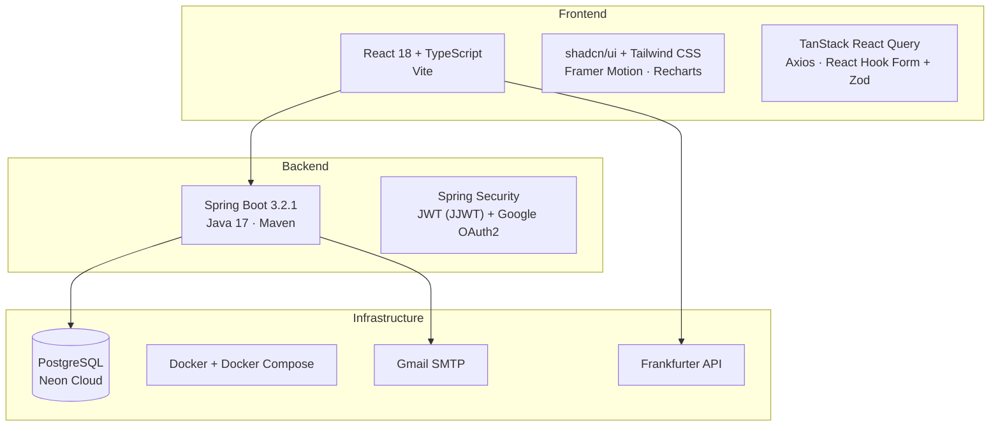

| Layer | Technology |
|---|---|
| Frontend | React 18 + TypeScript + Vite |
| Routing | React Router v6 |
| Server State | TanStack React Query |
| Forms | React Hook Form + Zod |
| UI | Tailwind CSS + shadcn/ui (Radix UI) · Framer Motion · Recharts |
| HTTP Client | Axios (auto token-refresh interceptor) |
| Backend | Spring Boot 3.2.1 · Java 17 · Maven |
| Security | Spring Security + JWT (JJWT 0.12.3) + Google OAuth2 |
| ORM | Spring Data JPA + Hibernate |
| Database | PostgreSQL (Neon cloud) |
| Email | Gmail SMTP (`JavaMailSender`, async) |
| Containerisation | Docker + Docker Compose |
| Currency | Frankfurter API (live FX rates) |

---

## 📌 Architecture

### High-level Architecture

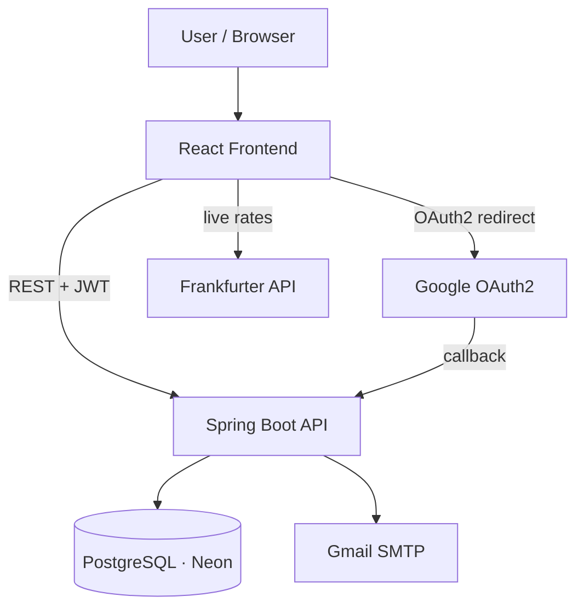

### System Architecture

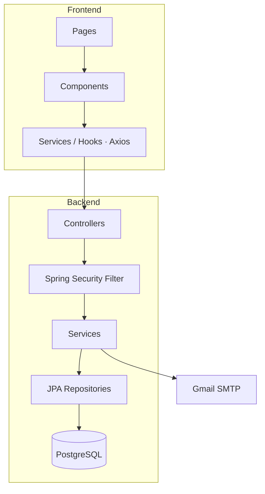

---

## 👤 User Flow

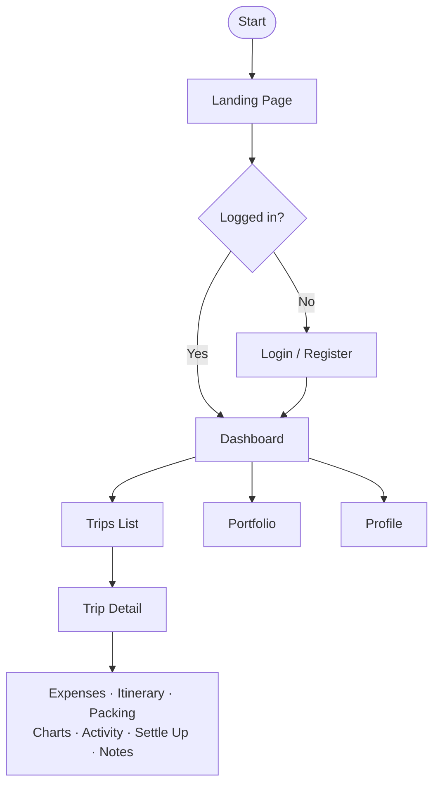

### Page Map

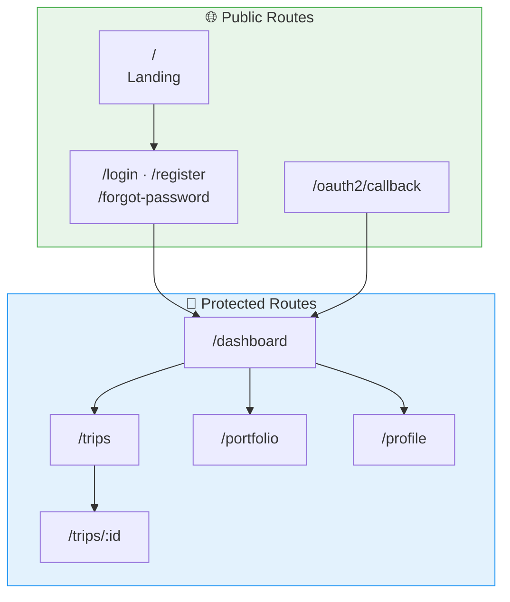

---

## 🔐 Auth & Session Flow

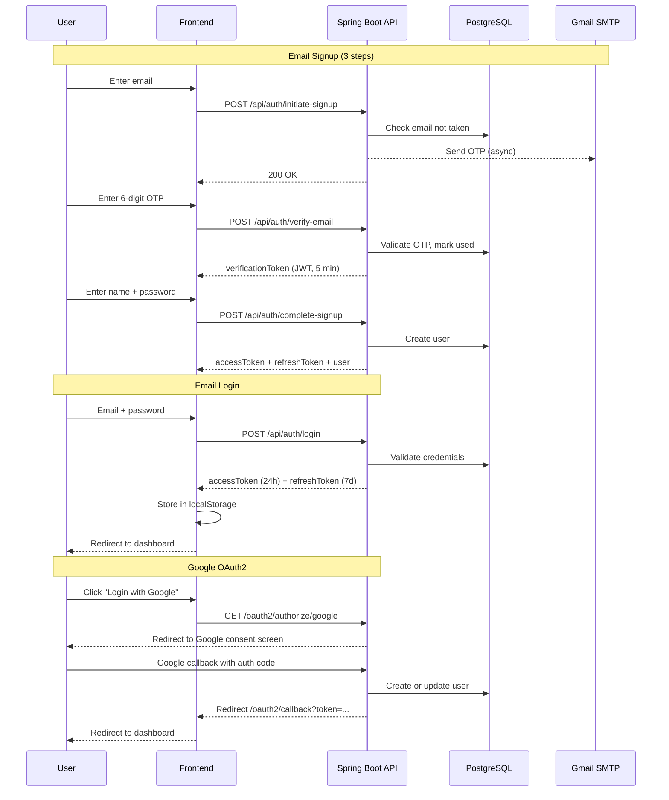

### Token Lifecycle

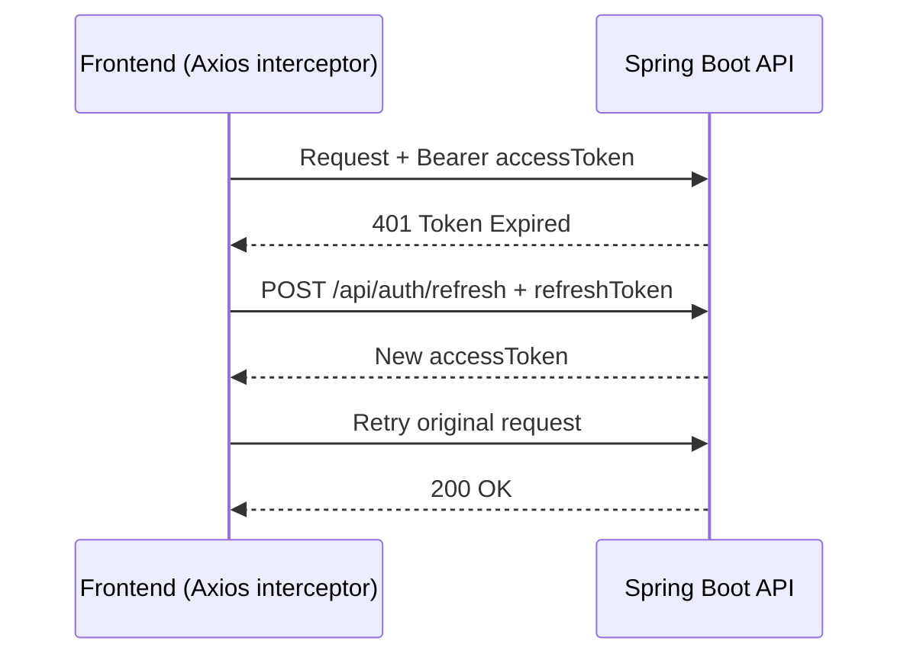

---

## 🗄️ Database (ERD)

### Core ERD

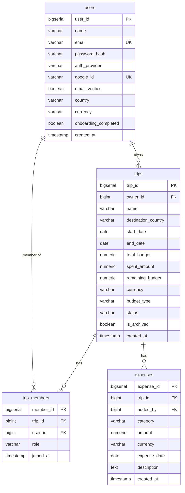

### Feature ERD

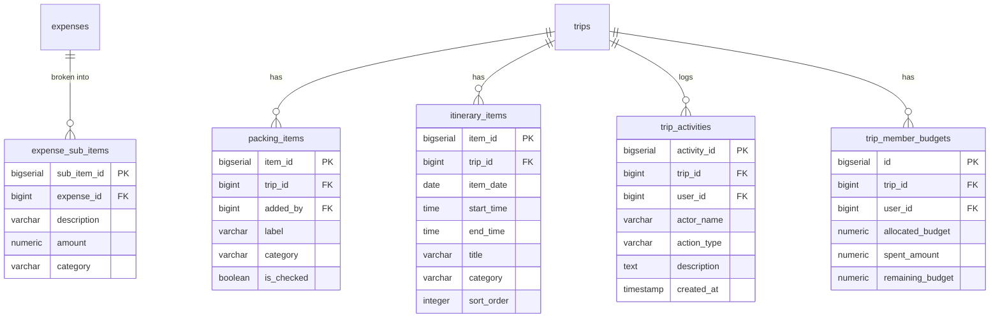

### Database Schema Overview

| Table | Purpose | Key Relations |
|---|---|---|
| `users` | User accounts — local + Google OAuth | — |
| `email_verification_codes` | OTP codes for signup + password reset | — |
| `trips` | Travel trips with budget info | belongs to `users` |
| `trip_members` | Links users to trips with roles | belongs to `users`, `trips` |
| `trip_member_budgets` | Per-member budget allocation (separated mode) | belongs to `trips`, `users` |
| `expenses` | Expenses per trip | belongs to `trips`, `users` |
| `expense_sub_items` | Per-category breakdown for bundle expenses | belongs to `expenses` |
| `packing_items` | Packing checklist items | belongs to `trips` |
| `itinerary_items` | Day-by-day planned activities | belongs to `trips` |
| `trip_activities` | Activity log / feed | belongs to `trips`, `users` |

> **DB Triggers:** `trg_update_trip_spent` auto-recalculates `trips.spent_amount` after any expense change. `remaining_budget` is a generated column (`total_budget − spent_amount`).

Full schema with column definitions → [DOCS.md § Database Schema](DOCS.md#database-schema)

---

## 🔌 API Structure

### API Overview

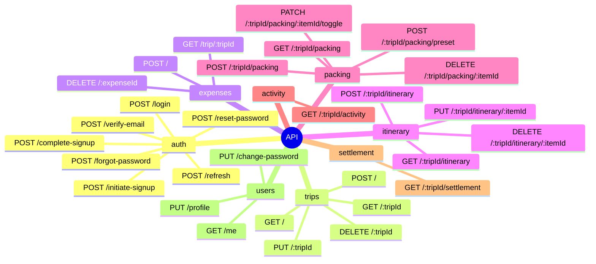

### Request/Response Flow

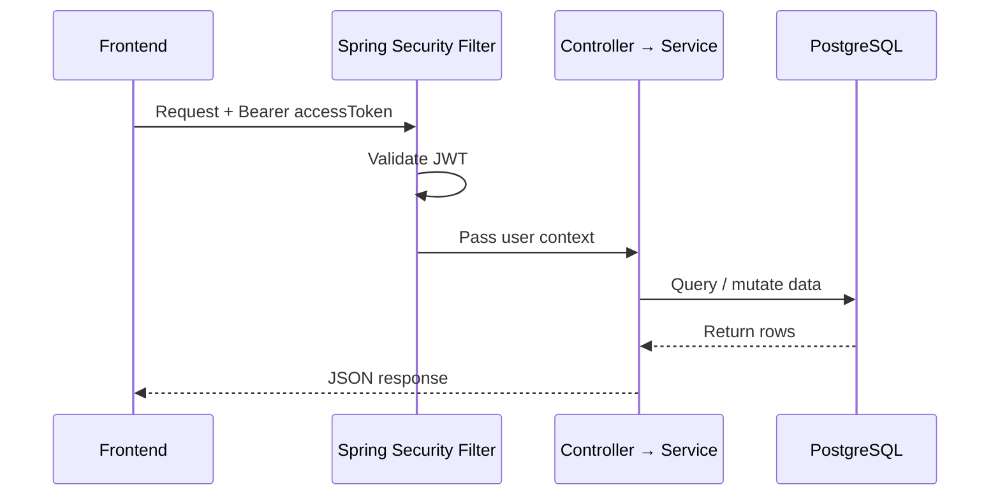

Full endpoint table with request/response shapes → [DOCS.md § API Endpoints Reference](DOCS.md#api-endpoints-reference)

---

## 🧩 Frontend Components

### Component Tree

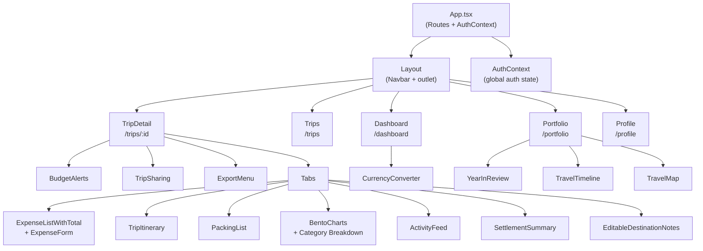

### Key Components

| Component | Purpose |
|---|---|
| `AuthContext` | Global auth state — user, tokens, login/logout |
| `ProtectedRoute` | Redirects to login if unauthenticated |
| `TokenRefreshHandler` | Axios interceptor wrapper for silent token refresh |
| `ExpenseForm` | Add expense with optional bundle sub-item support |
| `ExpenseListWithTotal` | Expense list with expandable bundle rows |
| `BentoCharts` | Analytics bento layout — radial gauge, pie, bar, trend |
| `SettlementSummary` | Who owes whom via greedy debt simplification |
| `PackingList` | Checklist with progress bar + preset pack loader |
| `TripItinerary` | Day-by-day planner with per-day activity cards |
| `TripSharing` | Member management dialog (UI only) |
| `PermissionGate` | Conditionally renders UI based on trip member role |
| `TravelMap` | Visual map of all visited destinations |

---

## ⚙️ Feature-specific Flows

### Trip CRUD Flow

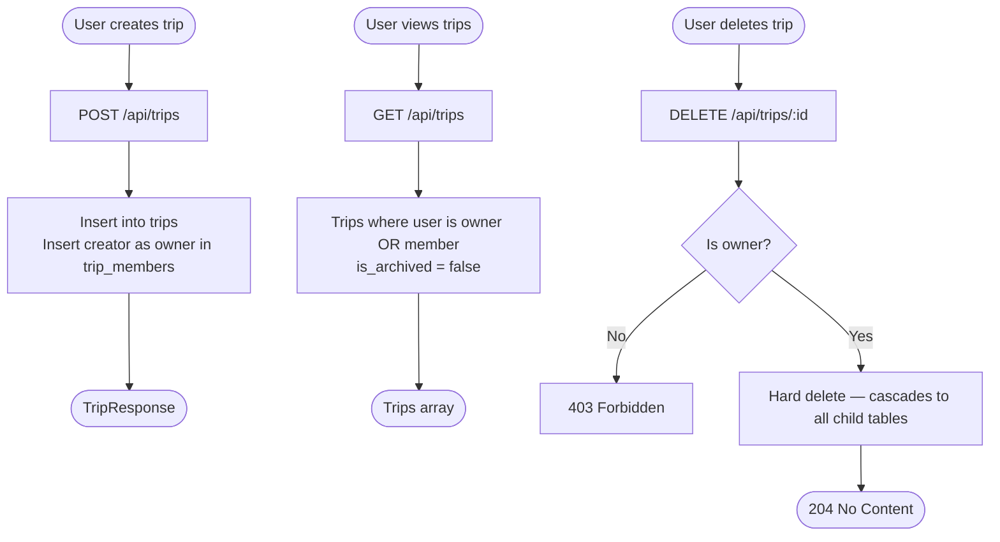

### Expense Flow

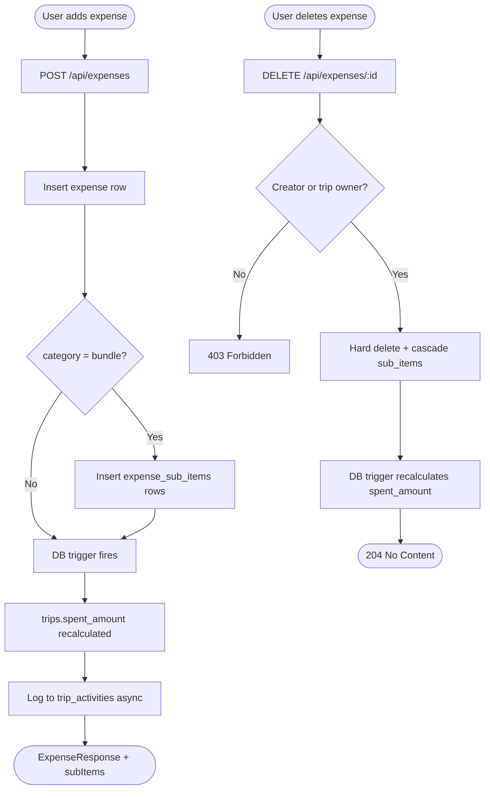

### Budget System

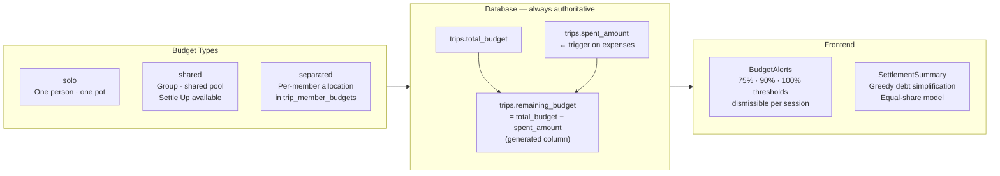

### Role & Permission Matrix

| Action | Owner | Editor | Viewer |
|---|---|---|---|
| View trip + expenses | ✅ | ✅ | ✅ |
| Edit trip details | ✅ | ✅ | ❌ |
| Delete trip | ✅ | ❌ | ❌ |
| Add expense | ✅ | ✅ | ❌ |
| Delete own expense | ✅ | ✅ | ❌ |
| Delete any expense | ✅ | ❌ | ❌ |
| Manage packing + itinerary | ✅ | ✅ | ❌ |
| View settle up | ✅ | ✅ | ✅ |
| Manage members *(UI only)* | ✅ | ❌ | ❌ |

---

## 🚀 Getting Started

### Prerequisites

- Docker + Docker Compose
- Node.js `>=18`

### Installation

```bash
git clone https://github.com/snsyaqirah/travelluhh.git
cd travelluhh
```

### Running locally

```bash
# Start backend (Docker)
docker compose up --build -d

# Start frontend
cd frontend
npm install
npm run dev
```

| Service | URL |
|---|---|
| Frontend | http://localhost:5173 |
| Backend API | http://localhost:8080 |

---

## 🔑 Environment Variables

### Backend — `backend/src/main/resources/application.yml`

```yaml
# Database
spring.datasource.url: jdbc:postgresql://<neon-host>/travelluhh
spring.datasource.username: <username>
spring.datasource.password: <password>

# JWT
jwt.secret: <secret>
jwt.expiration: 86400000          # 24 hours
jwt.refresh-expiration: 604800000 # 7 days

# Google OAuth2
spring.security.oauth2.client.registration.google.client-id: <client-id>
spring.security.oauth2.client.registration.google.client-secret: <client-secret>

# Email
spring.mail.username: <gmail-address>
spring.mail.password: <gmail-app-password>
```

### Frontend — `frontend/.env`

```env
VITE_API_BASE_URL=http://localhost:8080
```

---

## ☁️ Deployment

> Not yet deployed to production. Planned targets:

| Service | Platform | Purpose |
|---|---|---|
| Frontend | Vercel | React SPA hosting |
| Backend | Railway | Spring Boot API |
| Database | Neon | PostgreSQL (already cloud-hosted) |

---

## 📁 Project Structure

```
TravelLuhh/
├── docker-compose.yml
│
├── backend/
│   └── src/main/java/com/travelluhh/
│       ├── controller/     REST endpoints
│       ├── service/        Business logic
│       ├── repository/     JPA repositories
│       ├── entity/         JPA entities → DB tables
│       ├── dto/            Request + response DTOs
│       ├── security/       JWT filter, OAuth2 handlers
│       └── exception/      Global exception handler
│   └── src/main/resources/
│       ├── application.yml App config
│       └── schema.sql      Full DB DDL (manual migrations)
│
└── frontend/src/
    ├── pages/              Route-level components
    ├── components/         Feature UI components
    ├── services/           API call layer
    ├── hooks/              useTrips, useExpenses
    ├── context/            AuthContext
    ├── lib/                axios.ts, currency.ts, export.ts
    └── types/              TypeScript interfaces
```

---

## 🗺 Roadmap

- [x] Email signup with OTP + Google OAuth2
- [x] JWT auth with silent token refresh
- [x] Trip CRUD with archive
- [x] Expense tracking with bundle sub-items
- [x] Multi-currency support (Frankfurter live rates)
- [x] Budget modes (solo / shared / separated)
- [x] Budget alerts (75% / 90% / 100%)
- [x] Analytics & charts (bento layout)
- [x] Split bill / Settle Up
- [x] Packing checklist with preset packs
- [x] Day-by-day itinerary planner
- [x] Activity feed
- [x] Trip data export (CSV + PDF)
- [x] Travel portfolio (Year in Review · Timeline · Map)
- [x] User profile settings
- [x] Quick price currency converter
- [ ] Trip member invite / remove / role change (backend)
- [ ] Edit expense
- [ ] Separated budget allocation per member
- [ ] Notes persistence to database
- [ ] Refresh token revocation on logout
- [ ] Real-time collaboration (WebSocket/SSE)
- [ ] Trip image upload
- [ ] Push/email notifications for budget alerts

---

## 📄 License

[MIT](LICENSE) © 2025 Siti Nursyaqirah

---

> Full technical docs, flow diagrams, and known issues → [DOCS.md](DOCS.md)
